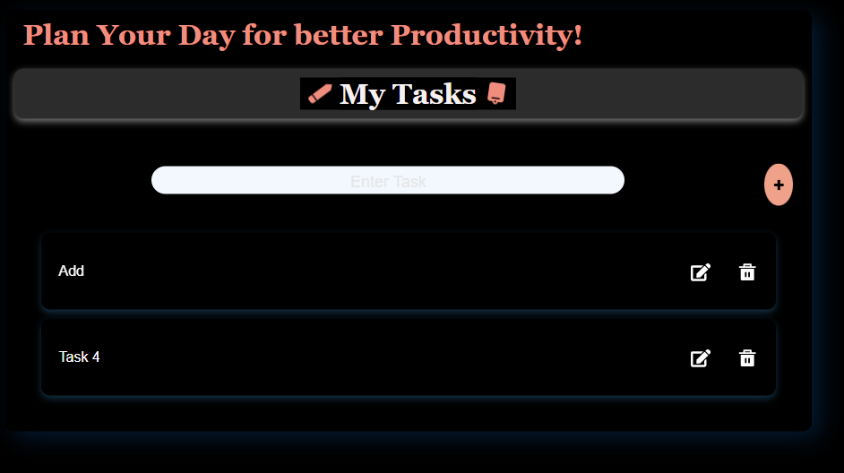
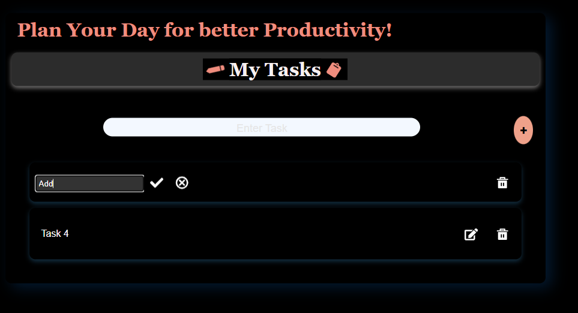
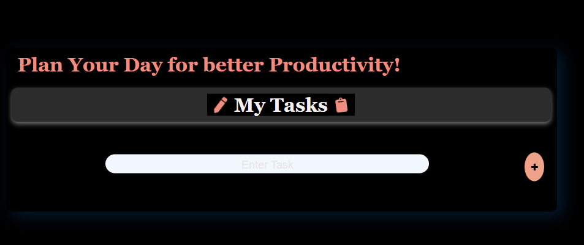

# To-Do List Web App Using ReactJs

This is a simple To-Do List web application built ReactJs and TypeScript. The app allows users to add, delete, and edit their tasks. It also allows users to cancel or proceed and save changes while they edit their tasks. This web app also uses local storage to save the tasks, ensuring they persist even after the browser is closed.
Once you add your task and press the button the task will appear when you refresh the page this is because when you add the  task fist it is going to be stored on your local storage and it will appear on your page once you reload the page and all your current tasks willl be retrieved from your local storage.

## Features

- Add tasks
- Delete tasks
- Edit tasks
- Persistent storage using local storage
- Local Storage
This app uses the browser's local storage to save tasks. This means that your tasks will be saved even if you close the browser or refresh the page.

## Instructions

### Running the App Locally

1. **Clone the Repository**
   
   git clone https://github.com/your-username/to-do-list-react.git
   cd to_do-list-react
2. **Open your vscode or anyother tool you use and open the index.html code with live server**

### How to Use

1. **Add a Task**
   - Enter the task in the input field.
   - Click the "Add Task" button or press Enter to add the task to the list.

2. **Delete a Task**
   - Click the "Delete" button next to the task you want to remove.

3. **Edit a Task**
   - Click the "Edit" button next to the task you want to modify.
   - Update the task in the input field and press Enter to save the changes.
   - You can save the changes you made in your task or you can cancel the changes and the task will remain the same.

4. **View Tasks**
   - To view the tasks you added you should reload the page.

